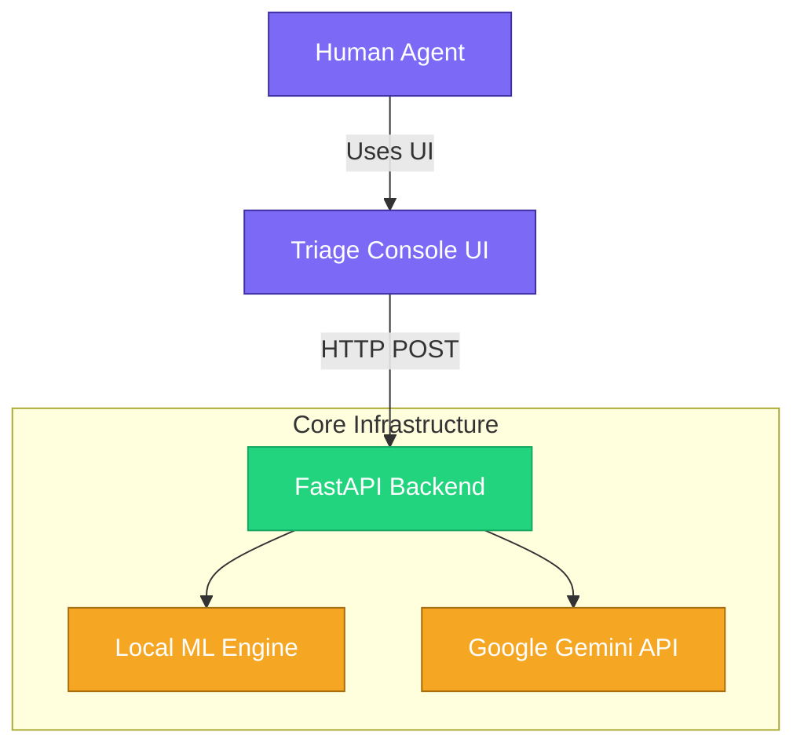
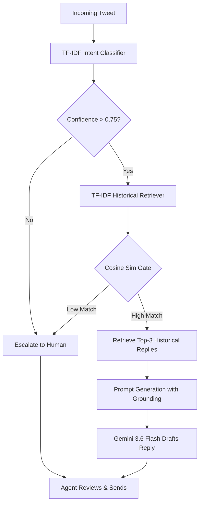

# 🚀 Hiver AI Support Agent

A production-grade, evaluation-driven AI customer support agent built for the Hiver SDE Intern assignment. 

This repository implements a robust **Retrieval-Augmented Generation (RAG)** pipeline using the Google Gemini 3.6 Flash API to draft support responses. To enforce strict safety and prevent AI hallucination, the backend incorporates an escalation gate and requires all generative drafts to be grounded in verified historical customer interactions (extracted from an AppleSupport Twitter dataset).

**Live Deployment:** [https://hiver-lwmn.onrender.com/](https://hiver-lwmn.onrender.com/)

---

## 🏗️ High-Level Design (HLD)



---

## ⚙️ Low-Level Design (LLD): Pipeline Flow



---

## ✨ Core Features

* **Real-time Intent Classification:** Uses a balanced Scikit-Learn TF-IDF model that achieves 97% training accuracy on a 6-intent taxonomy in milliseconds.
* **Generative Grounding (RAG):** Extracts historical context dynamically to ensure responses align with verified Brand policies, not internet hallucinations.
* **Auto-Escalation Engine:** Rejects low-confidence intent matches or poor historical retrievals safely with a mathematical threshold gate.
* **Triage Console UI:** A premium, single-page web dashboard built natively in HTML/Vanilla CSS featuring a Decision Log, metrics view, and dark/light modes suitable for a SaaS product.
* **Clean Monolith:** The interactive user interface is directly served from the FastAPI backend—no heavy Node.js or React requirements needed.

---

## 📂 Repository Structure

* `backend/` - The production FastAPI server (`app.py`), the Pydantic schemas, and the embedded single-page interactive UI (`triage.html`).
* `src/` - The Machine Learning operational environment. (Contains scripts for data cleaning, classifier training, and the retrieval engine logic).
* `apple_conversations.csv` - The processed training data (Ignored in Git, generated locally).
* `models/` - The serialized `.pkl` files for the TF-IDF vectorizers and classifiers.

---

## 🚀 Quickstart Guide

**Environment Setup**
```bash
# Provide python environment and dependencies
python3 -m venv venv
source venv/bin/activate
pip install -r backend/requirements.txt
```

**Booting the Engine**
Ensure your Gemini key is active in your terminal. Note: The frontend is cleanly served directly from the backend server!
```bash
cd backend
GEMINI_API_KEY="YOUR_API_KEY_HERE" uvicorn app:app --port 8000
```
Open a browser and navigate to **`http://localhost:8000`** to access the Triage Console dashboard!

